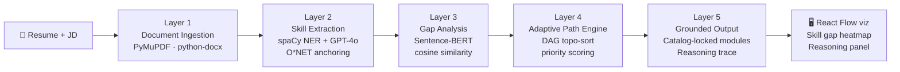

# AI-Adaptive Onboarding Engine

> Parse your resume + job description → get a personalized, DAG-optimised learning pathway with hallucination-free chain-of-thought reasoning.

This repository is being executed as a strict 24-hour build. Scope is intentionally MVP-first: reliable end-to-end analysis + grounded pathway output over non-critical polish.

[](http://localhost:8000/docs)
[](http://localhost:5173)

---

## Architecture



---

## 3-Command Setup

```bash
cp .env.example .env                      # 1. Create env file
docker compose up --build                 # 2. Build & start all services
open http://localhost:5173                # 3. Open the UI
```

## Local Development (No Docker)

**Backend**
```bash
cd api
python -m venv .venv && source .venv/bin/activate
pip install -r requirements.txt
uvicorn app.main:app --reload --host 0.0.0.0 --port 8000
```

**Frontend**
```bash
cd frontend
npm install
npm run dev
```

---

## Services

| Service  | URL                                         | Description              |
|----------|---------------------------------------------|--------------------------|
| Frontend | http://localhost:5173                       | React + Vite UI          |
| API      | http://localhost:8000/docs                  | FastAPI interactive docs |
| Health   | http://localhost:8000/health                | Health check             |
| Metrics  | http://localhost:8000/metrics               | Evaluation metrics       |
| Redis    | localhost:6379                              | Job queue + cache        |

---

## API — Sample Input/Output

**POST `/analyze`** (multipart/form-data)

```
resume=<file>   # PDF, DOCX, or TXT
jd=<file>       # PDF, DOCX, or TXT
```

**GET `/result/{job_id}`** — completed response:

```json
{
  "job_id": "d4a1c94f-...",
  "status": "completed",
  "result": {
    "summary": {
      "coverage_score": 0.86,
      "redundancy_reduction": 0.64,
      "estimated_total_minutes": 960
    },
    "pathway": {
      "nodes": [
        { "module_id": "mod_py_foundations", "title": "Python Foundations",
          "phase": "Foundation", "skills_targeted": ["2.B.3.g"], "reasoning_ref": "trace_001" }
      ],
      "edges": [
        { "from": "mod_py_foundations", "to": "mod_ml_intro", "type": "prerequisite" }
      ]
    },
    "reasoning_traces": [
      { "id": "trace_001", "module_id": "mod_py_foundations",
        "text": "Builds coding baseline required by all ML modules.", "confidence": 0.91 }
    ]
  }
}
```

---

## Evaluation Metrics

| Metric | Formula | Target |
|--------|---------|--------|
| **Coverage Score** | Required JD skills covered / Total required | ≥ 85% |
| **Redundancy Reduction** | Modules skipped vs static curriculum | ≥ 60% |
| **Path Efficiency** | 1 − (pathway depth / naïve baseline depth) | ≥ 40% |

See [`docs/METRICS.md`](docs/METRICS.md) for full mathematical definitions.

---

## Dataset Sources

- **O\*NET 28.0** — Skills, Abilities, Knowledge, Work Activities, Technology Skills (~1000 canonical nodes). [onetonline.org](https://www.onetonline.org/find/descriptor/browse/Skills/)
- **Kaggle Resume Dataset** — ~2484 labelled resumes across domains. [kaggle.com/dataset](https://www.kaggle.com/datasets/gauravduttakiit/resume-dataset)

See [`docs/DATASET.md`](docs/DATASET.md) for full citations.

---

## O*NET Data Bootstrap

```bash
# Requires data/db_30_1_text downloaded from O*NET
make bootstrap-data
# Or compact mode (SAB skills only):
python3 scripts/build_onet_skills.py --compact
```

---

## Course Catalog Service

Seed catalog modules are provided in `data/catalog/modules.json`.
The API loads this file at startup for module selection and prerequisite edges.
To use a different catalog, set:

```bash
CATALOG_PATH=/absolute/path/to/modules.json
```

Catalog module contract:
`{id, title, skill_ids[], domain, level, duration_min, prerequisites[]}`

---

## Known Limitations

- **Extraction latency**: LLM calls add 3–8s per resume; mitigated by async background jobs + Redis caching.
- **Sparse course catalog**: Pathway is only as good as the seeded catalog. Use `scripts/` to expand with O*NET-generated modules.
- **DAG size**: React Flow visualization capped at 20 nodes for clarity; full pathway returned in API JSON.
- **Domain coverage**: Currently optimised for Tech and Operations; Sales/Healthcare catalog coverage is partial.

---

## Project Structure

```
.
├── api/           # FastAPI backend + AI pipeline
│   ├── ai/        # extractor, embedder, gap_analyzer, reasoning_tracer
│   └── app/       # FastAPI endpoints
├── frontend/      # React + Vite + React Flow UI
│   └── src/       # App, UploadPanel, PathwayFlowGraph, ReasoningPanel…
├── data/          # O*NET data + generated indexes
├── scripts/       # Bootstrap utilities
├── docs/          # Architecture, API contract, metrics, dataset
└── docker-compose.yml
```
